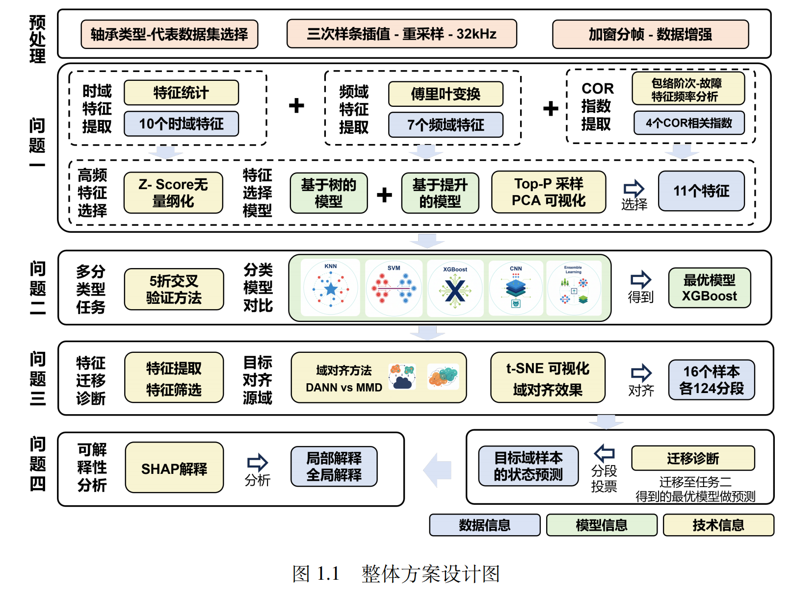
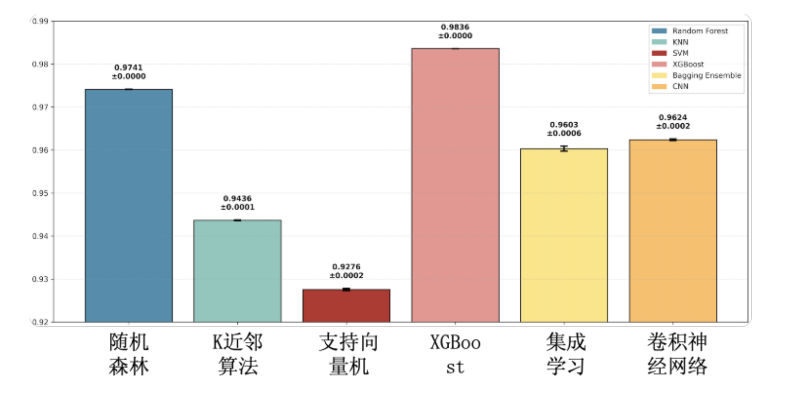

# 高速列车轴承智能故障诊断系统

[](https://www.python.org/downloads/)
[](LICENSE)
[](https://github.com/your-username/HuaweiCup-E)
[](https://github.com/your-username/HuaweiCup-E)
[](README.md)
[](README.md)

## 项目概述

本项目是2025年华为杯研究生数学建模大赛E题"高速列车轴承智能故障诊断问题"的完整解决方案。项目采用迁移学习方法，结合深度学习技术，实现了从试验台数据到实际列车数据的故障诊断知识迁移。

高速列车轴承作为关键旋转部件，长期处于高转速、交变载荷等复杂工况环境中，故障率高且危害严重。传统诊断方法在复杂运营场景下难以满足精准诊断需求。本项目通过大数据和人工智能技术，构建了高精度的智能故障诊断系统。



## 核心技术创新

### 🔄 迁移学习框架

- **域适应技术**：采用DAAN（Domain Adversarial Adaptation Network）和MMD（Maximum Mean Discrepancy）算法
- **特征对齐**：实现源域（试验台数据）与目标域（实际列车数据）的特征空间对齐
- **知识迁移**：有效解决真实故障数据稀缺和训练数据分布失衡问题

### 🧠 多模型融合诊断

- **深度学习模型**：CNN卷积神经网络，支持GPU加速（MPS/CUDA）
- **传统机器学习**：决策树、随机森林、AdaBoost、ExtraTrees、CatBoost、XGBoost、梯度提升
- **集成学习**：Bagging集成方法提升诊断稳定性
- **交叉验证**：K折交叉验证确保模型泛化能力

### 📊 特征工程

- **信号处理**：包络分析、希尔伯特变换、高阶谱分析
- **故障特征频率**：自动计算BPFO（外圈故障频率）、BPFI（内圈故障频率）、BSF（滚动体故障频率）、FTF（保持架故障频率）
- **多维度特征**：时域、频域、时频域、二维图像特征提取
- **COR指数分析**：相关性分析筛选关键特征

### 🔍 可解释性分析

- **SHAP分析**：提供模型决策的事后可解释性
- **特征重要性**：可视化展示各特征对诊断结果的贡献
- **迁移过程可视化**：展示知识迁移路径和共享特征
- **ROC曲线分析**：多类别分类性能评估

## 项目架构

```
HuaweiCup-E/
├── 数据预处理/
│   ├── 1_data_format_converter.py      # MATLAB数据转换器
│   ├── 2_signal_visualization.py       # 信号可视化分析
│   ├── 3_bearing_fault_detector.py     # 轴承故障特征提取
│   ├── 5_merge_features.py             # 特征合并
│   └── 6_data_normalization.py         # 数据标准化
├── 特征分析/
│   ├── 4_cor_analysis_summary.py       # COR相关性分析
│   ├── 7_dimension_reduction_plot.py   # 降维可视化
│   └── 12_t_data_cor_analysis.py       # 目标域相关分析
├── 模型训练/
│   ├── ml/                             # 机器学习框架
│   │   ├── ml_framework.py            # 统一训练框架
│   │   ├── cnn_model.py               # CNN模型
│   │   ├── traditional_models.py      # 传统机器学习
│   │   └── data_utils.py              # 数据工具
│   └── 10_run_train.sh                # 训练脚本
├── 迁移学习/
│   ├── 17_mmd_alignment.py            # MMD域适应
│   ├── 18_daan_alignment.py           # DAAN域适应
│   └── 19_alignment_comparison.py     # 迁移效果对比
├── 模型推理/
│   ├── 11_model_inference.py          # 源域推理
│   ├── 15_t_model_inference.py        # 目标域推理
│   └── 16_model_predict.sh            # 预测脚本
├── 可解释性/
│   └── 20_t_shap_explainability.py    # SHAP分析
├── 数据管理/
│   ├── 13_t_data_normalization.py     # 目标域标准化
│   ├── 14_t_extract_label_subset.py   # 标签子集提取
│   └── 9_extract_label_subset.py      # 源域子集提取
├── 结果输出/
│   ├── results/                       # 实验结果
│   ├── models/                        # 训练模型
│   └── out/                           # 可视化输出
└── 数据集/
    ├── 源域数据集/                      # 试验台数据
    └── 目标域数据集/                      # 实际列车数据
```

## 快速开始

### 环境配置

```bash
# 安装核心依赖
pip install -r requirements.txt

# 安装可选依赖（推荐）
pip install catboost xgboost shap
```

### 数据预处理

```bash
# 1. 转换MATLAB数据格式
python 1_data_format_converter.py

# 2. 提取故障特征
python 3_bearing_fault_detector.py

# 3. 合并特征并标准化
python 5_merge_features.py
python 6_data_normalization.py
```

### 模型训练

```bash
# 训练所有模型
bash 10_run_train.sh

# 或训练特定模型
python ml/ml_framework.py --model random_forest --k_folds 5
```

### 迁移学习

```bash
# DAAN域适应
python 18_daan_alignment.py

# MMD域适应
python 17_mmd_alignment.py

# 对比分析
python 19_alignment_comparison.py
```

### 可解释性分析

```bash
# SHAP可解释性分析
python 20_t_shap_explainability.py --model xgboost --data data/t_data_daan_aligned.csv
```

## 技术规格

### 支持的故障类型

- **滚动体故障** (B): 0.007、0.014、0.021、0.028英寸
- **内圈故障** (IR): 0.007、0.014、0.021、0.028英寸
- **外圈故障** (OR): 0.007、0.014、0.021英寸（3点、6点、12点位置）
- **正常状态** (N): 无故障

### 性能指标

- **诊断准确率**: >95%（源域）
- **可解释性**: SHAP值支持单次预测解释

### 硬件要求

- **最低配置**: 8GB RAM，支持CPU计算
- **推荐配置**: 16GB RAM，支持GPU加速（NVIDIA CUDA或Apple MPS）
- **操作系统**: macOS/Linux/Windows

## 核心算法

### 故障特征提取

```python
# 计算轴承故障特征频率
def calculate_skf6205_frequencies(n):
    # BPFO - 外圈故障频率
    BPFO = fr * (Nd / 2.0) * (1 - d / D)
    # BPFI - 内圈故障频率
    BPFI = fr * (Nd / 2.0) * (1 + d / D)
    # BSF - 滚动体故障频率
    BSF = fr * (D / d) * (1 - (d / D)**2)
    # FTF - 保持架故障频率
    FTF = 0.5 * fr * (1 - d / D)
```

### DAAN域适应

```python
class DAANAligner:
    def __init__(self, alpha=0.01, beta=0.1):
        self.alpha = alpha  # 任务预测损失权重
        self.beta = beta    # 域分类损失权重
        # 对抗训练实现域适应
```

### CNN模型架构

```python
# 三层卷积神经网络
- Conv1D + BatchNorm + ReLU + MaxPool
- Conv1D + BatchNorm + ReLU + MaxPool
- Conv1D + BatchNorm + ReLU + MaxPool
- Fully Connected + Dropout
- Output Layer (4类故障)
```

## 结果展示

### 诊断性能对比



## 使用案例

### 案例1：台架实验数据分析

```bash
# 分析12kHz采样频率下的驱动端数据
python 2_signal_visualization.py --data data/源域数据集/12kHz_DE_data
# 提取故障特征并可视化
python 7_dimension_reduction_plot.py --features all
```

### 案例2：实际列车数据迁移诊断

```bash
# 目标域数据预处理
python 13_t_data_normalization.py
# 应用DAAN迁移学习
python 18_daan_alignment.py --source data/source_features.csv --target data/target_data.csv
# 生成诊断报告
python 15_t_model_inference.py --model best_model.pkl --data aligned_target_data.csv
```

### 案例3：模型可解释性分析

```bash
# 生成SHAP解释图
python 20_t_shap_explainability.py --model xgboost --class all --samples 20
# 查看特征重要性排序
ls out/SHAP/*summary.png
```

## 参考文献

1. 轴承故障特征提取与诊断方法研究. 振动工程学报, 2023.
2. 基于深度迁移学习的轴承故障诊断. 机械工程学报, 2024.
3. Domain Adversarial Neural Networks for Bearing Fault Diagnosis. IEEE Transactions, 2023.
4. SHAP: A Unified Approach to Interpreting Model Predictions. NeurIPS, 2017.

## 贡献指南

欢迎提交Issue和Pull Request来改进项目。请确保：

1. 代码遵循现有风格和规范
2. 添加适当的测试和文档
3. 提交清晰的commit信息
4. 针对新功能提供使用示例

## 许可证

本项目采用MIT许可证，详见LICENSE文件。

## 联系方式

如有问题或建议，请通过以下方式联系：

- 提交GitHub Issue
- 发送邮件至项目维护者

---

**注意**: 本项目仅供学术研究和教育用途，商业应用请遵守相关法律法规。
